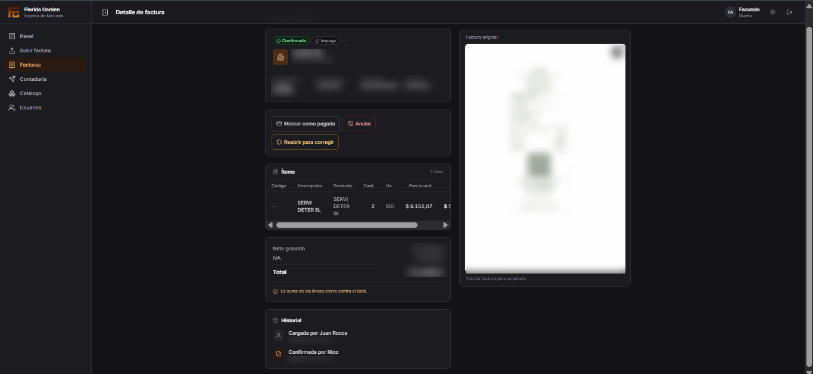
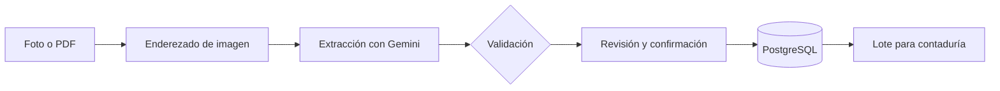
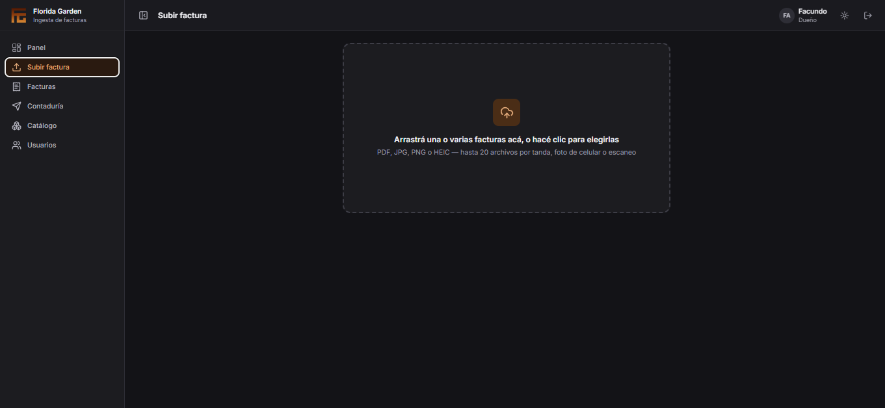
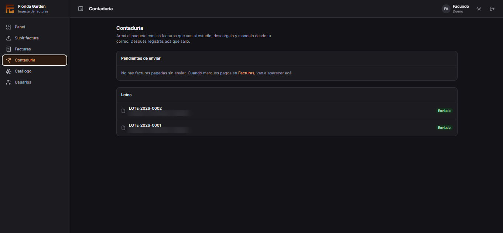

# Florida Garden — ERP de facturas de proveedor

Sistema web que lee facturas de proveedores a partir de una foto, identifica al proveedor, extrae cada línea con IA y valida el resultado al centavo antes de guardarlo.

Proyecto real desarrollado para Florida Garden, confitería de Florida 899, CABA.

**Stack:** TypeScript · Node.js · Fastify · React · PostgreSQL · Prisma · Gemini (Vertex AI) · Cloudflare R2 · Vitest

> El código fuente es privado por acuerdo con el cliente. Este repositorio documenta el problema, la arquitectura, las decisiones técnicas y mi aporte.

  

---

## El problema

El encargado del local copiaba a mano cada factura al sistema interno. Era un trabajo lento, con errores frecuentes y sin registro de quién cargó qué.

Automatizarlo tampoco era trivial, porque las facturas argentinas son difíciles de leer:

- Son escaneos sin texto extraíble.
- Cada proveedor usa un formato distinto: de 4 a 11 columnas y varios esquemas de descuento.
- Algunas llegan rotadas o torcidas, lo que desplaza los precios de fila.
- Incluyen campos locales (CUIT, CAE/CAEA, percepciones de IVA e IIBB) que las herramientas de OCR comerciales no reconocen.

## Cómo funciona

1. Se suben una o varias facturas desde el celular o la computadora.
2. La imagen se endereza y se envía a un modelo multimodal, que devuelve los datos en JSON.
3. **La IA no decide nada crítico.** Dos validadores determinísticos revisan cada resultado:
   - el CUIT, por dígito verificador;
   - las cuentas, en centavos enteros: la suma de las líneas tiene que dar el neto, y el neto más los impuestos tiene que dar el total.
4. El usuario revisa, corrige si hace falta y confirma.
5. Las facturas pagadas se agrupan en un lote ZIP (PDFs + resumen en CSV) para el estudio contable.

## Resultados

| | |
|---|---|
| Facturas reales procesadas correctamente | 10 de 10, cuadradas al centavo |
| Costo estimado de IA | ~USD 7 por mes cada 500 facturas |
| Tests automatizados | 555 |

## Elección del modelo de IA

Antes de elegir un modelo armamos un benchmark con facturas reales transcriptas a mano y comparamos cinco configuraciones campo por campo.

| Configuración | Sin errores críticos | Costo mensual |
|---|---|---|
| Gemini Flash Lite | 1 de 5 | USD 0,40 |
| Gemini Flash | 4 de 6 | USD 6,77 |
| **Enderezado + Gemini Flash** | **5 de 6** | **USD 7,36** |
| Mistral OCR + Gemini Flash | 2 de 4 | USD 10,01 |
| AWS Textract / Azure | — | no reconocen campos argentinos |

Lo que aprendimos:

- **Preprocesar la imagen rindió más que cambiar de modelo.** Enderezar las facturas rotadas eliminó el último error crítico.
- **El prompt pesó más que el modelo.** Pedirle que verificara sus propias cuentas bajó los errores críticos de 17 a 2.
- **Validar es tan importante como extraer.** El único error que sobrevivió lo detectó la validación de cuentas antes de que llegara al usuario.

## Arquitectura

- **Monorepo** con `web` (React + Vite), `api` (Node + Fastify + Prisma) y `shared`, donde vive el contrato de la API. Los tipos son compartidos, así que si cambia un campo en el backend, el frontend deja de compilar en vez de fallar en producción.
- **PostgreSQL** con transacciones: confirmar una factura modifica varias tablas a la vez.
- **Cloudflare R2** para los documentos, fuera de la base de datos.
- **Cola de procesamiento** sobre la propia base de datos, sin Redis. Sobrevive a reinicios y procesa hasta 3 facturas en paralelo.
- **Seguridad:** contraseñas con argon2, bloqueo por intentos fallidos, permisos por rol, registro de auditoría y verificación del tipo real de cada archivo subido.
- **CI** con build, linter y tests en cada cambio.

## Mi aporte

Proyecto de un equipo de tres. Mis partes principales:

- **Módulo de contaduría completo:**
  - reglas de negocio de los lotes, con numeración correlativa;
  - una restricción en la base de datos que impide que una factura esté en dos lotes abiertos;
  - 7 endpoints;
  - generación del ZIP;
  - pantallas en React;
  - más de 60 tests.
- **Resiliencia del servidor:** el proceso ya no se cae cuando la base de datos corta la conexión en medio de una transacción. Además, limité el pool de conexiones al plan contratado.
- **Validadores del benchmark:** verificación aritmética y de rangos de precio, que juntas detectaron todas las facturas con errores de la ronda de pruebas.
- **Pruebas en dispositivos reales** y mejoras de usabilidad en mobile.

## Capturas

  
  

---

Facundo Burguez · con Juan Cruz Rocca y Nicolás Fresca
[LinkedIn](https://www.linkedin.com/in/fburguez) · burguezfacu@gmail.com
